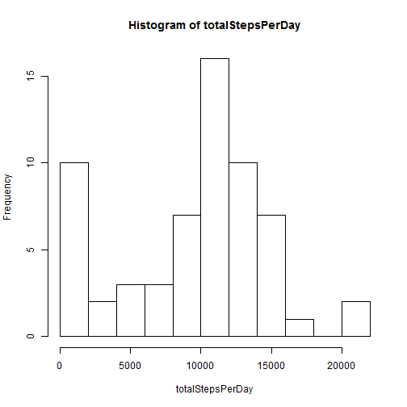
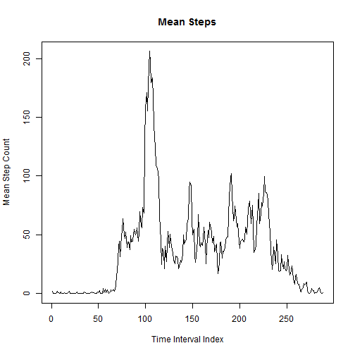
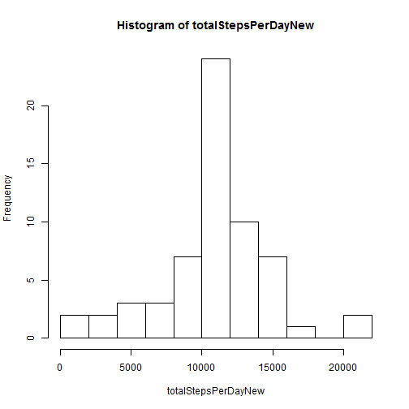
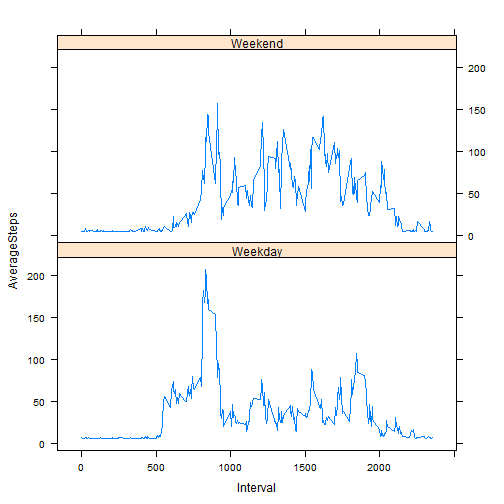

First step in analyzing the data (after reading it in) is to report the mean and median
number of steps / day and a histogram of the totals steps / day over the time frame of the 
data study.


```r
    data<-read.csv("activity.csv",sep=",")
  
    ## number of steps taken / day : histogram of total / day;  report mean, median / day
    totalStepsPerDay <- sapply(split(data$steps,data$date),sum,na.rm=TRUE)
    meanPerDay<-mean(totalStepsPerDay)
    medianPerDay<-median(totalStepsPerDay)
    summary(totalStepsPerDay)
```

```
##    Min. 1st Qu.  Median    Mean 3rd Qu.    Max. 
##       0    6780   10400    9350   12800   21200
```

```r
    hist(totalStepsPerDay,breaks=10)
```

 

The average daily activity pattern for all the days by 5 minute measurement interval,
along with the peak time interval, its index and value.


```r
    intervalsMean <- sapply(split(data$steps,data$interval),mean,na.rm=TRUE)
    maxValue<-max(intervalsMean)
```
The index and interval value of the peak/max mean steps count:

```r
    maxInterval<-which.max(intervalsMean)
    maxInterval
```

```
## 835 
## 104
```
Followed by the plot of the means:

```r
    plot(intervalsMean,xlab="Time Interval Index",ylab="Mean Step Count",type="l")
    title(main="Mean Steps")
```

 

The previous analysis dropped all 'NA' data from the data set, now we approximate a
suitable replacement for the missing values and input that into the data set.
We again report the mean and median values as above along with the histogram.
First the number of 'NA' values in the data set = 


```r
    naPresent <- apply(data, 1, function(x){any(is.na(x))})
    sum(naPresent) 
```

```
## [1] 2304
```
Then the results.

```r
    rdata<-data
    vect<-rdata$steps
    missing <- is.na(vect)
    rval<-mean(vect[!missing])
    if(is.na(rval))
        rval <- 0
    rdata$steps<-replace(vect, missing, rval)
 
    totalStepsPerDayNew <- sapply(split(rdata$steps,rdata$date),sum)
    meanPerDayNew<-mean(totalStepsPerDayNew)
    medianPerDayNew<-median(totalStepsPerDayNew)
    summary(totalStepsPerDayNew)
```

```
##    Min. 1st Qu.  Median    Mean 3rd Qu.    Max. 
##      41    9820   10800   10800   12800   21200
```

```r
    hist(totalStepsPerDayNew,breaks=10)
```

 

**Replacing the NA's with means produced a more normal distribution as you compare the
2 histograms.  **  

Finally, investigate the difference in the data between weekday and weekend measurements.

```r
    library(lattice)
    rdata$wweek<-weekdays(as.Date(rdata$date))
    rdata$wweek<-gsub("Saturday|Sunday","Weekend",rdata$wweek)
    rdata$wweek<-gsub("Monday|Tuesday|Wednesday|Thursday|Friday","Weekday",rdata$wweek)
    rdata$wweek<-as.factor(rdata$wweek)
    dataForPlot<-aggregate(rdata$steps ~ rdata$interval + rdata$wweek , data = rdata, mean)
    names(dataForPlot)<-c("Interval","DayFactor","AverageSteps")
    xyplot(AverageSteps~Interval | DayFactor, data=dataForPlot, layout=c(1,2), type="l")
```

 

The analysis is complete.

